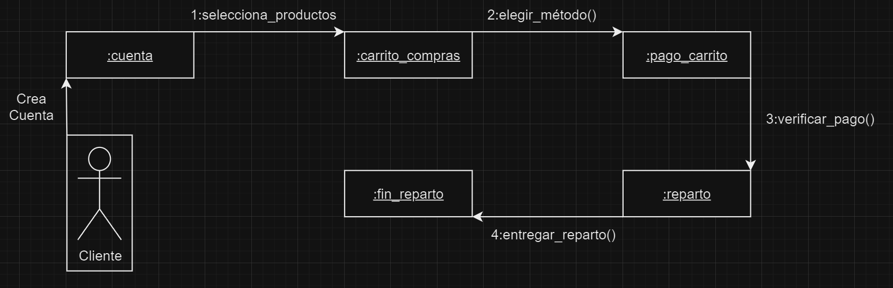
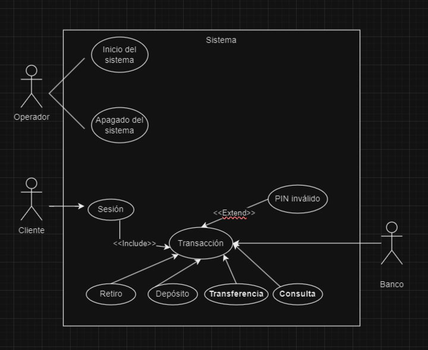

# 
Diagramas de Colaboración.

       
Participantes: Francisco Rojano, Miguel Martin, Alberto Mármol, Alejandro Luz  
Antonio Gómez, Antonio Matas, Rubén Salcedo y Javier Ordoñez.
ASIGNATURA: Entornos de Desarrollo.
CURSO: 1º DAM.
AÑO: 2023/2024.
---
## 
Objetos, actores y relaciones

  
<v-click>1. Objetos: Son las partes que realizan acciones en el sistema, pueden ser ejemplos reales como un ordenador o ejemplos más abstractos como puede ser una cuenta de usuario.</v-click>
  
<v-click>2.Actores: Son las personas u otras cosas externas al sistema que interactúan con él, como un usuario o un dispositivo.</v-click>
  
<v-click>3.Relaciones: Son las conexiones o interacciones entre los objetos y los actores, como puede ser enviar mensajes o compartir información.</v-click>
---
## 
Envío de Mensajes

 
<v-click>1. Mensaje Simple: Este tipo de mensaje representa la transferencia de control de un objeto a otro. Es decir, un objeto envía un mensaje a otro objeto sin esperar ninguna respuesta.</v-click>
  
<v-click>2. Mensaje Sincrónico: Este tipo de mensaje hace que el objeto que lo envía espere una respuesta antes de poder continuar en su ciclo de vida. Es decir, el emisor y el receptor están conectados y participan de un intercambio de manera simultánea. Por ejemplo, dos personas hablando por chat.</v-click>
  
<v-click>3. Mensaje Asíncrono: Este tipo de mensaje permite que el objeto continúe en su ejecución sin esperar una respuesta. Es decir, el emisor y el receptor intercambian información de manera diferida. Por ejemplo, una persona deja un comentario en un blog.</v-click>
---
## 
Ejemplos de Uso

El uso de puntos de diagrama de colaboración en un sistema de gestión de pedidos en una tienda en línea facilita la visualización de momentos clave en la interacción entre objetos, como el cliente, el carrito de compras, el inventario y el sistema de pago.
<v-click>
 

</v-click>
---
## 
Ejemplos de Uso

El siguiente ejemplo muestra un sistema de cajero automático.
<v-click>

</v-click>
---

  

    <h1>¡Muchas gracias por su tiempo y atención!</h1>
     
    <h3>Espero que la presentación haya sido informativa y útil.</h3>
     
    
¡Hasta pronto!

  

